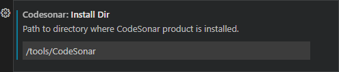
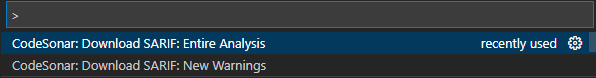
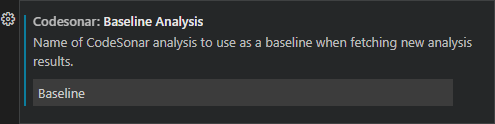

# CodeSonar Extension for Visual Studio Code

This extension from [GrammaTech](https://www.grammatech.com) provides
access to static code analysis results from a *CodeSonar* hub inside
Visual Studio Code.

# Setting Up

Before you begin, make sure you have all of the following installed on your local system.

- A functioning build environment. If your build tools are not already in
  in your `PATH`, add them now.
- [CodeSonar](https://www.grammatech.com/products/source-code-analysis)
  version `7.1p0` or later.
- VS Code version `1.70.1` or later.
- The VS Code [Sarif
  Viewer](https://marketplace.visualstudio.com/items?itemName=MS-SarifVSCode.sarif-viewer)
  extension from Microsoft.
- The VS Code **CodeSonar extension**.

You will also need access to a CodeSonar hub running CodeSonar `7.1p0` or later.

- Make a note of the hub location (protocol, host, and port): you will need this
  to configure the CodeSonar extension.
- Determine whether you require credentials to access the hub (this
  will depend on your organization's hub setup). If so, you will need
  to provide these credentials for hub interactions via the CodeSonar extension.


# Getting Started

## Notes

- The instructions in this document assume a single user working on a
project. People working in teams will have to adapt the instructions
for things like **Settings** and **Tasks**.

## Step A: Create a New Project

1. First, we need some code to scan. Create a new folder and add a
   file named `Basic.c` to it. Copy the following code snippet to the
   file:

   ```c
   #include <stdlib.h>

   int main()
   {
       char buf[10];
       char *q;

       switch( rand() )
       {
         case 1:        /* straightforward null dereference */
           q = NULL;
           buf[0] = q[0];
           break;

         case 2:        /* a less-obvious potential null dereference  
                         * - the value returned by malloc may be NULL 
                         *   and should be checked 
                         * - also a leak, since q is never freed */
           q = (char *) malloc(10 * sizeof(char));
           q[0] = 'a';
           break;
       }
       return 0;    
   }
   ```

2. Now, add a makefile for the project. Create a file named `Makefile` in your project folder and copy the following snippet to it:

   ``` make
   CC = gcc

   all: Basic

   Basic: Basic.c
   	  $(CC) -o $@ $?

   clean:
   	  rm -f *.o *~ core Basic
   ```

   If you do not usually build with `gcc` and `make`, you can adapt this step to use your regular tools:
   - If you use `make` with a compiler other than `gcc`, change the `CC` macro on
     line 1 to call your compiler.
   - If you use a build tool other than `make` (such as `nmake`, shell
     script, `.bat` file, CMake, SCons, MSBuild,...), create a script or
     file to instruct your tool to compile `Basic.c` with your compiler.


### Make Sure it all Works

Before moving on to analyzing and automating the project, make sure it builds.

1. If you have not already done so, open a terminal from the **Terminal > New Terminal** menu.

2. Type `make all` in the terminal to build the project.

If the project builds, your environment is properly configured and you
can move on to **Step B: Run an Analysis**.

If you experience a build problem, use your regular build diagnostics
to determine a resolution. Many problems can be resolved by making
sure tools are actually installed and the `PATH` environment variable
is properly set.


## Step B: Run an Analysis

Now, we want to run an initial analysis. We need to create a command
that will instruct CodeSonar to analyze a build and send the results
to a hub. The general form that we will use here is:

```shell
<CodeSonar-Install-Dir>/codesonar/bin/codesonar analyze <Project-File> -auth <Authentication-Mode> [<authdata>] \
   -name <Analysis-Name> -project <Project-Name> <Hub-Address> <SaaS-Options> <Build-Command>`
```

Where:
- `<CodeSonar-Install-Dir>` is the path to your CodeSonar installation.
- `<Project-File>` is the path to the directory where you will store
  analysis information.
- `<Authentication-Mode>`  is one of {`anonymous`, `password`, `certificate`}.
- `[<authdata>]`  depends on the specified `<Authentication-Mode>`:
   - `anonymous`: *nothing*
   - `password`: `[-hubuser <Hub-Username> [-hubpwfile
     <Password-File>]]`. CodeSonar will interactively prompt you for a
     hub username and password if neither is provided, or for password
     if a hub username is provided but a password file is not.
   - `certificate`: `-hubcert <Certificate-File> -hubkey
     <Privatekey-File>`, where `<Certificate-File>` is the path to the
     *user certificate* to use for hub authentication and
     `<Privatekey-File>` is the path to the corresponding private key
     (this will be used to sign CodeSonar's response to the hub
     challenge, not uploaded to the hub).
- `<Analysis-Name>` is the name to use for the current analysis of
  your project.
- `<Project-Name>` is the name that the CodeSonar hub will use to
  identify the project you are analyzing. It can be the same as the
  basename of your project file, but does not have to be, and should
  remain fixed across all analyses of the project. You can also
  optionally specify the project's *project tree ancestors*, if there
  are any.
- `<Hub-Address>` is the location (protocol, host, and port) of your CodeSonar hub.
- `<SaaS-Options>`: if you are using CodeSonar SaaS, add `-remote "/saas/*"` to your command line.
- `<Build-Command>` is the command that you usually use to build your software project.

For full documentation of all command line options, see the CodeSonar manual.

1. Construct a CodeSonar build/analysis command for your project by replacing the placeholders in above with actual data for your environment.

   For example, for a hub located at `http://localhost:7340`:

   ```shell
   $ /tools/CodeSonar/codesonar/bin/codesonar analyze Basic -auth password -hubuser shoresy \
        -name Baseline -project Basic http://localhost:7340 make all
   ```

   For CodeSonar SaaS with a hub located at `https://myhub.codesonar.com:12345`:
   
   ```shell
   $ /tools/CodeSonar/codesonar/bin/codesonar analyze Basic -auth password -hubuser shoresy \
        -name Baseline -project Basic -remote "/saas/*" https://myhub.codesonar.com:12345 make all
   ```

   Your command line will be be different. Differences will depend on
   your CodeSonar installation path, on hub location and
   authentication details, and on whether you are building the
   `Basic.c` project with `make` or a different tool.

2. Execute your command.
   - If this is the first time you are building a project and you have
     not yet accepted the CodeSonar license agreement, CodeSonar will
     print the text of the agreement and ask whether you want to
     accept it. Press `y` to accept the license and proceed with the
     build.
   - If this is the first time you are building a project and you have
     not yet specified whether you want to upload anonymized usage
     statistics to GrammaTech, CodeSonar will ask "Send anonymous
     usage statistics to GrammaTech?" now.  Press `y` to opt in; `n` to
     opt out.
   - [Windows Vista or later only] If User Account Control is enabled,
     your system may display a dialog to request permission for `cs_uac_daemonize.exe`
     from GrammaTech, Inc to continue. Click **Continue** to proceed.
   - [Windows only] If you are running CodeSonar with services, a
     services authentication dialog may open. Enter your username and
     password, and click **OK** to authenticate the service.

   CodeSonar will build and analyze the project, then print a URL for
   analysis results. You do not need to open this URL in your browser:
   the CodeSonar VS Code extension allows you to download the
   analysis results and display them directly in VS Code.

   If there is a problem with the build/analysis, use the error
   information displayed by CodeSonar to resolve the problem and try
   again.

## Step C: Save CodeSonar Information in Settings

We are going to store the information from your analysis command line
so we can use it later. The extension has several options, and
explaining them all is beyond the scope of this document, but we will
use the most important options to get started.

1. Open the Settings page by selecting  **File > Preferences > Settings** (or typing `CRTL`-`,`).

2. To make the next few steps easier, filter on the CodeSonar
   extension settings by typing `codesonar` in the **Search settings**
   widget.  

### CodeSonar installation directory

Specify the root of your CodeSonar installation in **Install Dir**.
You need this local installation to run the CodeSonar analysis and communicate with the hub. 



### Hub location

Enter your **Hub Address**: protocol, host, and port.


### Hub authentication

Select your hub **Authentication Mode** by selecting a value from the pull-down menu.


Once you have selected an authentication mode, add mode-specific authentication information:

- `anonymous`: no further information required.
- `password`: Specify the `Hub User` and `Hub Password File`. If you
  don't specify these, CodeSonar will interactively prompt you when
  the analysis is invoked.
- `certificate`: Specify the `Hub User Certificate` and `Hub User
  Certificate Key`. If you don't specify these, CodeSonar will attempt
  to find these files at default locations as described in the
  CodeSonar manual.

In this example, we will log in to the hub with a username and
password so we enter a valid username in **Hub User**.


### Project name

Enter your hub **Project** name (the value you specified with
`-project <Project-Name>` in your command line). Include the project tree path if
there is one.

### Project file

Enter your **Project File** name (the value you specified with
`<Project-File>` in your command line). Include the file path if you
do not want to store it directly under your working directory.

CodeSonar will create the project file at this location, along with a
sibling directory to store the information that it collects about your
project as it observes your normal build command. Unless you are using
CodeSonar SaaS, the same directory is used to store internal
representation and other information generated by the CodeSonar
analysis (if you are using CodeSonar SaaS there is a separate, remote
analysis directory).

## Step D: Download Analysis Results

Once you have performed a CodeSonar analysis you can download its results and examine them within VS Code.

1. Open the Command Palette by selecting **View > Command Palette...** (or typing `CTRL`-`Shift`-`P`).

2. Select  **CodeSonar: Download SARIF: Entire Analysis**.

   

3. You may be prompted for additional information.
   - If the extension cannot determine exactly which hub project you
     are interested in, a list of projects. Click the project you
     want to select.
   - If you didn't configure a **Project File** setting, a
     list of all the analyses of the project. Click the analysis
     whose results you want to download.

4. You will be prompted to save the SARIF file on your local
   machine. Specify a suitable location. You can save the file
   anywhere, but it can be easier to use a subdirectory in your source
   folder.

   Once saved, the file will be opened in the SARIF viewer and you can
   begin assessing warnings.


### Note on downloading results

You can download the results of any analysis on the hub, provided that
you are authorizing as a hub user with the necessary permissions for
that analysis. It does not have to be an analysis that you ran yourself.

If you wish to choose from among all analyses on the hub, leave the
**Project File** setting empty. If you configure a **Project File**
setting, the **CodeSonar: Download SARIF [...]** commands will always
automatically select the last analysis that you performed with that
setting.


## Step E: Look at some warnings

Initially, the SARIF viewer will show a collapsed view with heading **3 SARIF Results**.


All the CodeSonar analysis results are in file `Basic.c`, since that is the only file in the project.

1. Click the `>` to the left of  `Basic.c` to expand the list of results in that file.

   

   We will look at the first result on the list: the result on line `12` with message beginning `q is dereferenced here`.

2. Click the first result in the list.
   - The contents of `Basic.c` will be displayed, with line `12`
     highlighted`.
   - A new panel of information will be displayed, showing the
     **Analysis Steps** leading to the CodeSonar warning.

3. Click each of the displayed **Analysis Steps** in turn to
   highlight the key code points leading to the Null Pointer
   Dereference at line `12`.

4. Switch from the **Locations** tab to the **Rules** tab. This
   contains the same set of results as the **Locations** tab, but grouped
   by SARIF Rule (that is, CodeSonar warning class) instead of by the
   file in which each warning is issued.

5. Click on the entry for the Null Pointer Dereference at line 20.

   The source panel and **Analysis Steps** will update to show information about this warning.


## Step F: Achieve Repeatable Analyses with a Task

You can have CodeSonar analyze your code as a VS Code *Task*.

1. Create new file  `<workdir>/.vscode/tasks.json`, where `<workdir>` is your current working directory.

2. Copy the following code into your new `tasks.json` file.

   ```json
   {
     "inputs": [
       {
         "id": "codesonarAnalysisName",
         "type": "promptString",
         "description": "CodeSonar analysis name",
         "default": "Analysis-1234"
       }
     ],
     "tasks": [
       {
         "type": "shell",
         "label": "C/C++: CodeSonar analyze",
         "command": "${config:codesonar.installDir}${pathSeparator}codesonar${pathSeparator}bin${pathSeparator}codesonar",
         "args": [
           "analyze",
           "${config:codesonar.projectFile}",
           "-auth", "password",
           "-hubuser", "${config:codesonar.hubUser}",
           "-name", "${input:codesonarAnalysisName}",
           "-project", "${config:codesonar.project}",
           "${config:codesonar.hubAddress}",
           "make", "all"
         ],
         "group": "build",
         "detail": "builder: make"
       }
     ]
   }
   ```
   
3. If your CodeSonar command line uses different elements, edit the
   `tasks.args` list to account for these elements. The following are
   some common cases; if necessary consult the full command line
   documentation in the CodeSonar manual.

   - If you are not using `make` to build your project:
      - replace `"make", "all"` with your build command, *and*
      - update the value of `detail`
   - If you are using CodeSonar SaaS:
      - add `"-remote", "\"/saas/*\","`
   - If you are using password-based authentication and providing a
     password file:
      - add `"-hubpwfile", "{codesonar.hubPasswordFile}",`
   - If your authentication mode is "anonymous":
      - delete `"-hubuser", "${config:codesonar.hubUser}",`
   - If you are using certificate-based authentication:
      - add `"-hubcert", "${codesonar.hubUserCertificate}",` *and*
      - add `"-hubkey", "${codesonar.hubUserCertificateKey}",` *and*
      - delete `"-hubuser", "${config:codesonar.hubUser}",`


4. Clean your project in preparation for testing the task.

   If you are using make with the Makefile we defined earlier, execute the following command in the terminal.

   ``` shell
   $ make clean
   ``` 

   Otherwise, execute the equivalent command for your build tool.

5. Run the task: select **Terminal > Run Task... > C/C++: CodeSonar analyze**.

   

   Unless you changed the corresponding parts of the `tasks.json` file
   text provided above, you will be prompted for an analysis
   name. Since we already have a baseline, let's call this
   *Analysis-1*. You can pick any naming convention you like, or skip
   this prompt altogether when you modify your task going forward.

   

This task will start a build in the terminal, and if you entered the
data in the settings correctly, this should have the same result as
typing the command manually. If not, check the warnings in the
terminal and adjust your settings accordingly.

Once the analysis completes successfully, you can download its results
from the hub as we did in **Step D: Download Analysis Results**.

## Step G: Experiment
Now that you know the basic theory of operation, you can experiment with the settings, create your own tasks, modify the code to fix errors or introduce new one, and apply this to a full project.


# Controlling the Set of Downloaded Warnings

The CodeSonar extension provides several options for controlling the set of downloaded warnings.
- Downloading only new warnings.
- Downloading only warnings that match a specific *warning filter*.


## Downloading Only New Warnings.

The CodeSonar extension for VS Code allows you to compare two analyses
and download only newer warnings. This saves time and allows you to
focus on what is important. To use this feature, you need to define a
baseline analysis against which to compare.

1. Open the Settings page and enter the name of your baseline analysis
   in the **Baseline Analysis** field.

   We named our first analysis *Baseline*.

   

2. We can test this feature by performing another analysis and downloading only the new warnings.

   First, modify your `Basic.c` file to add code containing a new
   bug. For example, you could add the following additional case to
   the `switch` statement.

   ```c
   case 4:        /* rand() may return a value >= 10 */
     buf[rand()] = 'a';
     break;
   ```

3. Run the CodeSonar analysis again: select **Terminal > Run Task... > C/C++: CodeSonar analyze.**

4. Open the command palette and type `CodeSonar:`, then select **CodeSonar: Download SARIF: New Warnings**. 

   

   - If you have not configured a **Baseline Analysis** setting, you will be prompted to *Select a Baseline Analysis*.
   - If you have not configured a **Project File** setting, you will be prompted to select the analysis to download.

5. View the downloaded results. The list will only include warnings
   that are new since your baseline analysis. If you added the example
   case provided, there will be one warning: a Buffer Overrun.

6. If you are interested, download the full set of results for the
   same analysis with **CodeSonar: Download SARIF: Entire Analysis** and
   use your file system tools to compare the file sizes and contents.


## Downloading only warnings that match a specific warning filter

If you configure a value for the **Warning Filter** setting, the
**CodeSonar: Download SARIF: Entire Analysis** and **CodeSonar:
Download SARIF: New Warnings** commands will only download warnings
that meet the conditions of the corresponding filter.

The available warning filters, and their IDs, will depend on how your
hub is configured. To see a full list, view the **Saved Searches**
page of the hub web GUI. Note that the ID column is not displayed by
default: you will need to use the table menu to add it.

# Explore Some Additional Settings

## Compress the SARIF file during download

You can save some bandwidth by requesting a SARIF file without
whitespaces from the hub. The compressed file will not be as easy for a human to
read, but can be up to 50% smaller than the uncompressed version. This
can speed up downloads for large projects.


