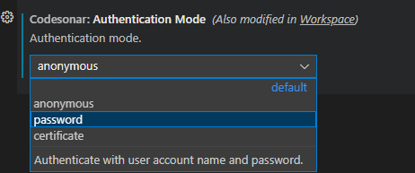
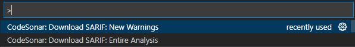

# CodeSonar Extension for Visual Studio Code

This extension from [GrammaTech](https://grammatech.com) provides access to static code analysis results from a *CodeSonar* hub inside Visual Studio Code.

**Requirements**
- Access to a [CodeSonar](https://www.grammatech.com/products/source-code-analysis) hub of version `7.1p0`.
- The latest version of the CodeSonar extension requires at least VSCode `1.70.1`.
- A functioning build environment.
- The [Sarif Viewer](https://marketplace.visualstudio.com/items?itemName=MS-SarifVSCode.sarif-viewer) extension from Microsoft.

# Getting Started
VSCode is an editor; it does not ship with a built-in compiler or build tools. Before starting, you should ensure you have CodeSonar, build tools such as *make*, and a compiler, like *gcc*, installed and available in the PATH. 

**Note**: The instructions in this README assume a single user working on a project. People working in teams will have to adapt the instructions for things like **Settings** and **Tasks** when you deploy this for multiple engineers.

## Step 1: Create a New Project
First, we need some code to scan. Create a new folder and add a file named `Basic.c` to it. Copy the following code snippet to the file:
```c
int main()
{
    char buf[10];
    char *q;

    /* Straightforward null dereference */
    q = NULL;
    buf[0] = q[0];

    /* You should check the malloc return value and there is a leak */
    q = (char *) malloc(10 * sizeof(char));
    q[0] = 'C';
    q[1] = 'S';
    q[2] = 'O';

    return 0;    
}
```
Now, we need a makefile to help us build the project. The instructions are slightly different, depending on your installed compiler and operating system, and you are encouraged to modify them as needed.

### Linux
Add a file named `Makefile` to your project and copy the following snippet to it:
``` make
CC = gcc

all: Basic

Basic: Basic.c
	$(CC) -o $@ $?

clean:
	rm -f *.o *~ core Basic
```
### Windows
Add a file named `Basic.mak` to your project and add the following snippet to it:
``` make
CC = cl

all = Basic.exe

Basic.exe: Basic.c
	$(CC) Basic.c /link /out:Basic.exe

clean:
	del /q *.obj *~ Basic.exe
```
If you are using a compiler other than `gcc` or `cl`, you should change the CC macro on line 1 to call the your compiler.

### Make Sure it all Works
We will add tasks to automate our project later, but for now, make sure the project builds. If you have not already done so, open a terminal from the `Terminal > New Terminal` menu. 

On a Linux system, type `make all` in the terminal. On Windows, type `nmake -f Basic.mak`. If the project builds, your environment is properly configured and you can move on to step 2. 

Unfortunately, diagnosing build failures is outside the scope of this README. Many problems can be resolved by making sure tools are actually installed and the PATH environment variable is properly set.

## Step 2: Run an Analysis
Now, we want to run an initial analysis. We need to create a command that will instruct CodeSonar to analyze a build and send the results to a hub. The format of the command is:

`<Install Dir>/codesonar/bin/codesonar analyze <Project File> -project <Project> -auth <Authentication Mode> -hubuser <Hub User> -name <Analysis Name> <Hub Address> make`

Replace the variables with actual data for your environment. An example command for a first analysis:

```shell
$ /opt/codesonar-7.1p0/codesonar/bin/codesonar analyze Basic -auth password -hubuser shoresy -project /Basic -name Baseline http://localhost:7340 make
```

Your command line will be be different, depending on where you have CodeSonar installed, how you login to your hub, and where you intend to store project information.

## Step 3: Save that Information in Settings
We are going to store the information from the command line you just tested so we can use it later. The extension has several options, and explaining them all is beyond the scope of this README, but we will use the most important options to get started.

Open the Setting dialog by typing `CRTL`-`,`. To make the next few steps easier, filter on the CodeSonar extension settings by typing `codesonar` in the **Search settings** widget.


### Where is CodeSonar installed
To run an analysis, you need access to a local installation of CodeSonar. Define the root of your installation in **InstallDir**.


## Where is your hub
You need to define the URL of the hub you want to interact with. In this example, the hub is a remote server. Enter the address of *your* hub in **Hub Address**.


## Define how you provide credentials
In order to interact with a hub, you usually need to provide credentials. You have to instruct the extension how to authenticate with the hub by selecting an option in **Authentication Mode**.


In this example, we will login to the hub with a user name and password so we enter a valid username on **Hub User**. For this tutorial, we are fine being prompted for a password, so we leave the **Hub Password File** field blank.


## Step 4: Download an Analysis
You can request the results of a scan from a hub you have login privileges on. Type `CTRL`-`Shift`-`P` to open the command palette, and then select `CodeSonar: Download SARIF: Entire Analysis`


You will be prompted to save the SARIF file on your local machine. You can save the file anywhere, but it can be easier to use a subdirectory in your source folder. Once saved, the file will be opened in the SARIF viewer and you can begin assessing warnings. 

## Step 5: Achieve Repeatable Analyses with a Task
If you want to have CodeSonar analyze your code as a VSCode *Task*, you can start from this one and customize to your specific needs:
 
### On-prem hub
```json
"inputs": [
  {
    "id": "codesonarAnalysisName",
    "type": "promptString",
    "description": "CodeSonar analysis name (no spaces allowed in name)",
    "default": "Analysis-1234"
  }
],
"tasks": [
  {
    "type": "shell",
    "label": "C/C++: CodeSonar analyze",
    "command": "${config:codesonar.installDir}${pathSeparator}codesonar${pathSeparator}bin${pathSeparator}codesonar",
    "args": [
      "analyze",
      "${config:codesonar.projectFile}",
      "-auth", "password",
      "-hubuser", "${config:codesonar.hubUser}",
      "-project", "${config:codesonar.project}",
      "-name", "${input:codesonarAnalysisName}",
      "${config:codesonar.hubAddress}",
      "make", "all"
    ],
    "group": "build",
    "detail": "builder: make"
  }
]
```
Now we want to test the task. Type 
``` shell
$ make clean
``` 
or 
``` shell
$ nmake -f Makefile.mak clean
``` 
in the terminal. Then, run the task by selecting the `Terminal`>`Run Task...` menu and selecting the `C/C++: CodeSonar analyze` task we defined.


If you used the exact task we defined in step 5, you will be prompted for an analysis name. Since we already have a baseline, let's call this *Analysis-1*. You can pick any naming convention you like, or skip this prompt altogether when you modify your task going forward.


This task will start a build in the terminal, and if you entered the data in the settings correctly, this should have the same result as typing the command manually. If not, check the warnings in the terminal and adjust your settings accordingly.

Once the analysis completes successfully, you can download it from the hub as we did in **Step 4**.

## Step 6: Experiment
Now that you know the basic theory of operation, you can experiment with the setings, create your own tasks, modify the code to fix errors or introduce new one, and apply this to a full project.

# Define a Baseline Analysis
The CodeSonar extension for VSCode allows you to compare two analyses and download only newer warnings. This saves time and allows you to focus on what is important. To unlock this feature, you need to define a baseline analysis against which to compare. If you recall, we named our first analysis *Baseline*. We will enter that analysis name in the **Baseline Analysis**** setting, but you can select any full analysis in the project.


Open the command pallette and type `CodeSonar:`, then select the `CodeSonar:Download SARIF;New Warnings` command. 



The extension will request the newer warnings in your last analysis compared with your baseline. If you did not specify a baseline in your **Settings**, the extension will prompt you for one.

# Explore Some Additional Settings
## Compress the SARIF file during download
You can save some bandwidth by requesting a SARIF file without whitespaces from the hub. This file will not be as easy for a human to read, but can reduce the size of the SARIF file by up to 50% which can speed up downloads for large projects. 


